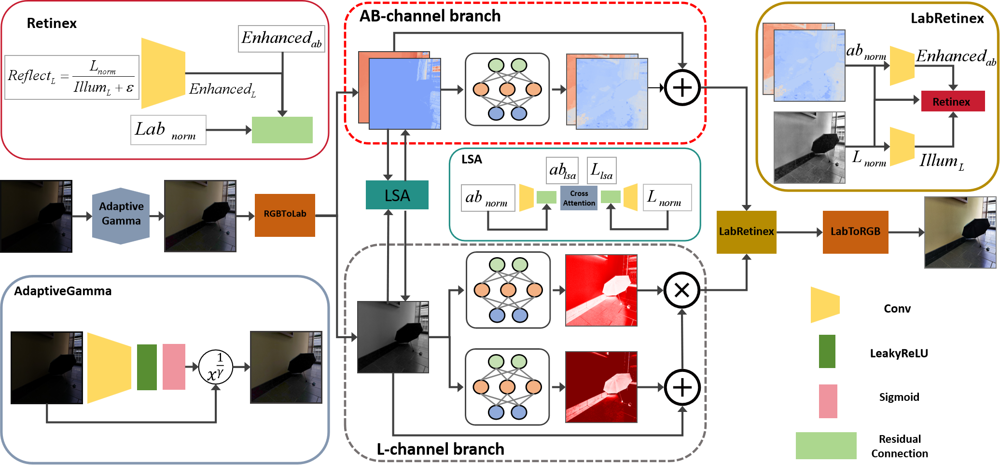
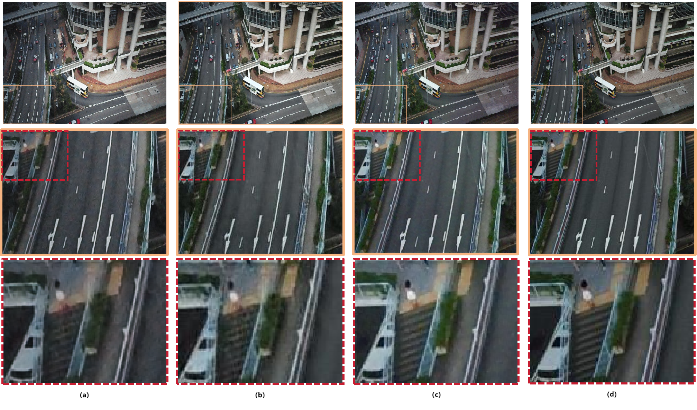
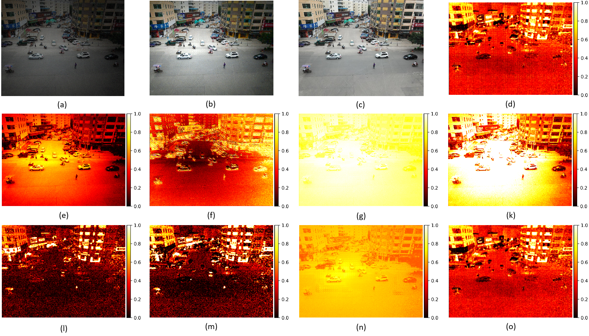
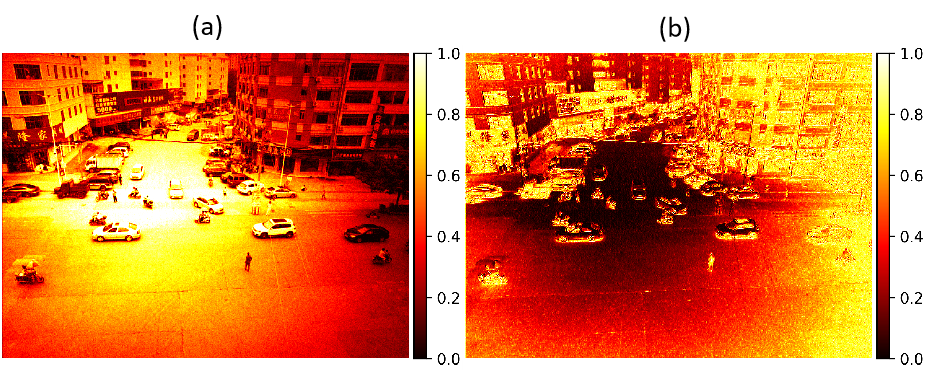
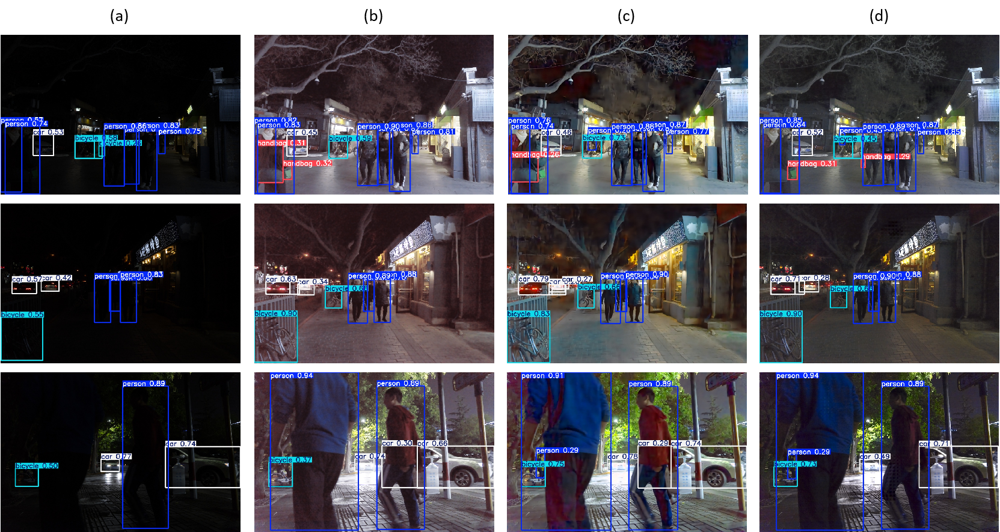

# BCC-LabNet：低光照图像增强（Lab & Retinex 协同）

> 本文档从论文稿中提取了**关键示意图与说明**，用于快速了解方法与实验结果。

**要点**：在 CIE-Lab 空间进行三分支解耦（亮度/对比度/色彩），结合 **LSA / Cross-Attention** 与 **LabRetinex** 物理先验细化，实现增强与去噪的一体化协同；在 LOLv1、LOLv2-Real、VisDrone、LSRW-Huawei 等数据集上取得领先或并列领先的 PSNR/SSIM，并在无参考 NIQE/UICM、下游 DarkFace 检测等任务上表现优异。

*图1 BCC-LabNet 框架示意：Lab 空间解耦 + LSA/Cross-Attention + LabRetinex 协同细化。*

*图2 视觉效果对比：LYT-Net、CIDNet、BCC-LabNet 与 GT（VisDrone 典型场景）。*

*图3 模块可解释性分析：ΔL/注意力/色度残差等中间可视化与参数化重建。*

*图4 Retinex 分解中间状态：光照分量 I 与反射分量 R 的可视化。*

*图5 下游目标检测（DarkFace，YOLOv11s）：不同增强方法对检测效果影响的对比。*

