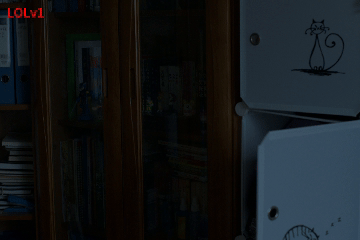
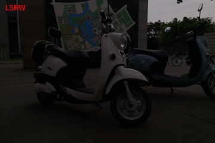
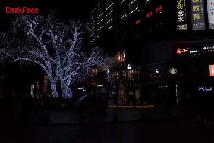
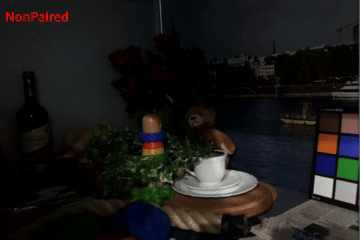
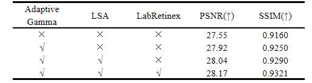
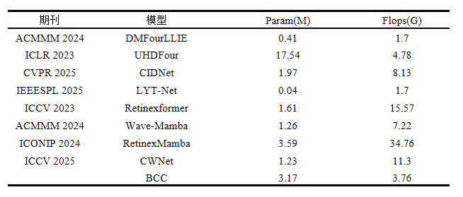
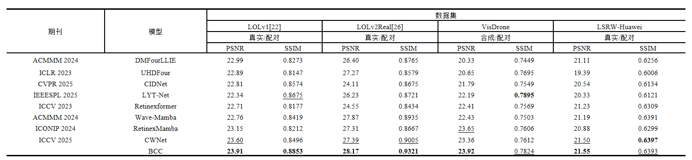
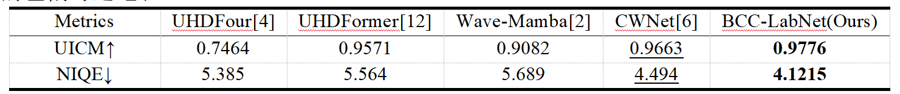
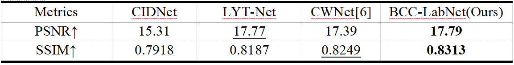

<div align="right">

**中文** ｜ [English](README_EN.md)

</div>







# BCC-LabNet：面向可解释与强泛化的解耦低光照图像增强网络

> 本仓库包含 **BCC‑LabNet** 的训练、验证、测试与数据合成脚本，用于在低光照场景下对图像进行增强与细节恢复。模型在 Lab 颜色空间进行建模，并结合 Retinex 思想与注意力模块以提升亮度与色度一致性。


---

## 目录
- [环境准备](#环境准备)
- [数据准备](#数据准备)
- [训练 Train](#训练-train)
- [验证与可视化 Val](#验证与可视化-val)
- [测试 Test / 指标评估](#测试-test--指标评估)
- [消融实验](#消融实验)
- [运行效率对比](#运行效率对比)
- [对比实验](#对比实验)
- [泛化性实验](#泛化性实验)
- [合成低光数据（可选）](#合成低光数据可选)
- [损失函数设计](#损失函数设计)
- [数据集相关下载](#数据集相关下载)
- [许可证](#许可证)
- [目录说明](#目录说明)
- [参考与致谢](#参考与致谢)

---

## 环境准备

```bash
conda env create -f BCC.yml
conda activate base
```

> 关键依赖：PyTorch、`pytorch-msssim`、`opencv-python`、`pyiqa`（用于 NIQE 指标）、`torchvision` 等。

---

## 数据准备

默认 **成对数据**（低光/正常曝光）：

```
data/
 └─ LOLv1/
    ├─ Train/
    │  ├─ input/
    │  └─ target/
    └─ Test/
       ├─ input/
       └─ target/
```

支持 **LoLI‑Street**、**LOLv2** 等，只需按需配置 `train.py` / `test.py` 路径。

---

## 训练 Train

1. 在 `train.py` 顶部设置：`train_low`, `train_high`, `test_low`, `test_high`  
2. 运行：

```bash
python train.py
```

- 默认 **256×256 随机裁剪**、`batch_size=1`；优化器 **AdamW**（lr `2e-4`）+ **OneCycleLR**；  
- 训练过程在验证集计算 PSNR/SSIM；支持加载预训练权重（`strict=False`）。

---

## 验证与可视化 Val

`val.py` 可视化：增强 RGB、`ΔL`、注意力图、照明/反射分量；直方图/伽马可视化；一键保存。  
可参考 `get_attention_with_hook` 钩出中间量。

---

## 测试 Test / 指标评估

在 `test.py` 填好路径与权重后：

```bash
python test.py
```

- 输出增强图与 **PSNR / SSIM**；提供 **NIQE**（无参考）；无 GT 时用 `LowOnlyDataset` + NIQE。

---

## 消融实验

在 **LOLv2‑Real** 上验证核心模块。



> 说明：BCC 为**通道未压缩**；基线为仅三子网解耦；**未使用 GT‑Mean**。

---

## 运行效率对比

**3.17M 参数 / 3.76G FLOPs**，相对同档模型更省算力且保持竞争力。



> 说明：**未使用 GT‑Mean**。

---

## 对比实验

LOL‑v1 / LOL‑v2‑Real / VisDrone / LSRW‑Huawei 的量化对比。最佳/次佳以 **粗体** 与 _下划线_ 标注。



> 说明：**未使用 GT‑Mean**。

---

## 泛化性实验

采用 DICM、LIME、MEF、NPE、VV 等五个无参考低光数据集；在相同设置下 **NIQE = 4.1215**、**UICM = 0.9776**。



> 说明：**未使用 GT‑Mean**。

跨数据集：在 LOL‑v1 训练，在 LoLI‑Street 抽取 200 图测试，无需微调。



> 说明：**未使用 GT‑Mean**。

---

## 合成低光数据（可选）

`synthesize_low_light.py`：
- `batch_simulate_low_light(...)`：简易暗化 + 轻噪声；
- `batch_realistic_simulation(...)`：非均匀更逼真暗化，并保存暗化因子映射。

---

## 损失函数设计

`CombinedLoss`：Smooth‑L1、VGG‑19 感知、直方图、PSNR 约束、Color/Mean 约束、（可选）MS‑SSIM。

```bash
百度云：BCC-Files
https://pan.baidu.com/s/1gTVcG7pbiOWWtay-7fkzZw?pwd=79sa  提取码: 79sa

Google Drive:
https://drive.google.com/drive/folders/1JlGYF8-zxhlJAb6Sp0yH3B5qlQvrd5EJ?usp=sharing
```

---

## 数据集相关下载

```bash
https://pan.baidu.com/s/1gikbndlP69_j0hXJ4MmUbw?pwd=ntmx  提取码: ntmx 
```

---

## 许可证

默认**学术研究用途**；商用/再发布请联系作者。

---

## 目录说明

```
.
├── BCC.yml
├── train.py / val.py / test.py
├── dataloader.py
├── losses.py
├── synthesize_low_light.py
└── overview.png
```

---

## 参考与致谢

感谢 LIME、NPE、Retinex 系列、EnlightenGAN、Kindling the Darkness、Deep Retinex Decomposition 等工作。
