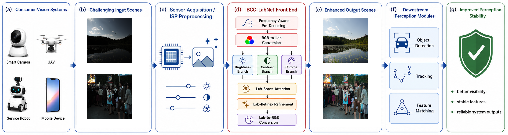
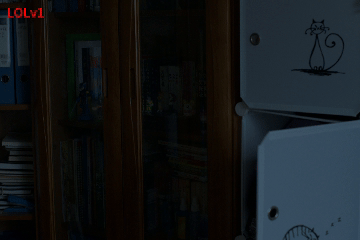
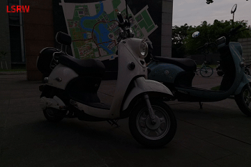
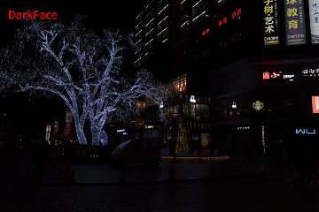
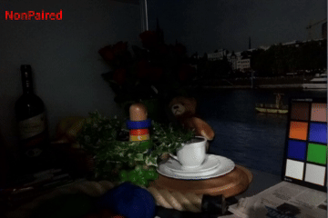
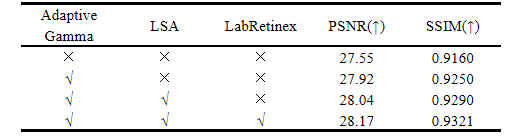
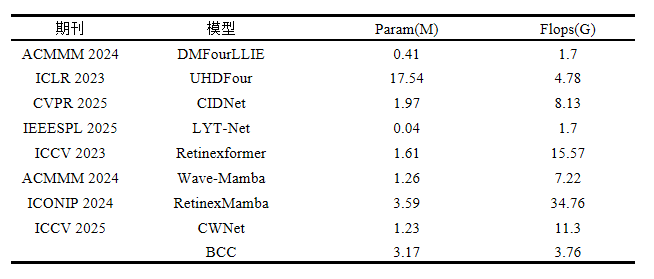
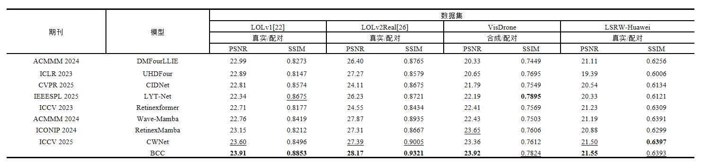
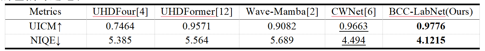
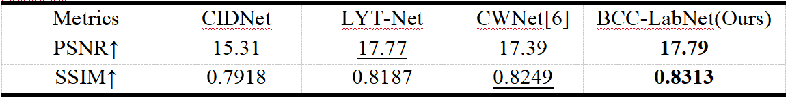

<div align="right">

[中文](README.md) ｜ **English**

</div>







# Low-Light Image Enhancement for Perception Stability in Consumer Vision Systems

>Low-light visual perception remains a major challenge in consumer vision systems, including unmanned aerial vehicles, consumer robotic platforms, and edge imaging devices,where computation, memory bandwidth, and power consumption are tightly constrained. Existing deep enhancement models therefore often struggle to achieve real-time and deploymentfriendly performance. In addition, low-illumination conditions introduce severe sensor noise, insufffcient photon capture, and nonlinear imaging distortions, resulting in degraded contrast,color bias, and loss of structural details that further impair downstream vision tasks. To address these issues, we propose BCCLabNet, a lightweight and deployment-oriented low-light image enhancement network for real-time edge vision applications. The proposed method explicitly decouples brightness, contrast, and chroma in the CIE-Lab color space and processes them with three lightweight branches to improve representation stability and interpretability. A frequency-aware denoising module with adaptive gamma correction is introduced to enhance robustness under extreme low-light conditions, while a Lab-space attention mechanism and a Retinex-inspired reffnement module preserve structural consistency and local illumination ffdelity with low computational overhead. Extensive experiments on paired and unpaired low-light datasets show that BCC-LabNet achieves competitive performance in PSNR, SSIM, LPIPS, and no-reference metrics including NIQE, BRISQUE, and UICM. Moreover, downstream detection and tracking evaluations, together with onboard inference compatibility validation on Unitree Go1 and real-world UAV low-light detection deployment, support its practical edgedeployment capability. Overall, BCC-LabNet achieves a favorable trade-off between visual quality and computational efffciency.


---

## Contents
- [Environment](#environment)
- [Data Preparation](#data-preparation)
- [Training](#training)
- [Validation & Visualization](#validation--visualization)
- [Testing / Metrics](#testing--metrics)
- [Ablation Studies](#ablation-studies)
- [Efficiency Comparison](#efficiency-comparison)
- [Comparative Results](#comparative-results)
- [Generalization Experiments](#generalization-experiments)
- [Synthetic Low‑Light Data (Optional)](#synthetic-low-light-data-optional)
- [Loss Design](#loss-design)
- [Dataset Links](#dataset-links)
- [License](#license)
- [Project Tree](#project-tree)
- [References & Acknowledgements](#references--acknowledgements)

---

## Environment

```bash
conda env create -f BCC.yml
conda activate bcc
```

> Key deps: PyTorch, `pytorch-msssim`, `opencv-python`, `pyiqa` (NIQE), `torchvision`.

---

## Data Preparation

Paired data (low/normal). Example:

```
data/
 └─ LOLv1/
    ├─ Train/
    │  ├─ input/
    │  └─ target/
    └─ Test/
       ├─ input/
       └─ target/
```

Other sets (LoLI‑Street, LOLv2) are supported—configure paths in `train.py` / `test.py`.

---

## Training

1) Set `train_low`, `train_high`, `test_low`, `test_high` in `train.py`.  
2) Run:

```bash
python train.py
```

- Default **256×256 crops**, `batch_size=1`; **AdamW** (lr `2e-4`) + **OneCycleLR**;  
- PSNR/SSIM on val during training; supports loading checkpoints (`strict=False`).

---

## Validation & Visualization

`val.py` shows enhanced RGB, `ΔL`, attention, illumination/reflection; histogram/gamma views; one‑click save. Use `get_attention_with_hook` to inspect intermediate tensors.

---

## Testing / Metrics

```bash
python test.py
```

Saves outputs and **PSNR/SSIM**; includes **NIQE**; for low‑only use `LowOnlyDataset` + NIQE.

---

## Ablation Studies

Ablations on **LOLv2‑Real**.



> BCC is channel‑uncompressed; baseline is three‑branch only; **no GT‑Mean**.

---

## Efficiency Comparison

**3.17M params / 3.76G FLOPs**, competitive quality with lower compute than many peers.



> **No GT‑Mean**.

---

## Comparative Results

LOL‑v1 / LOL‑v2‑Real / VisDrone / LSRW‑Huawei quantitative comparison.



> **No GT‑Mean**.

---

## Generalization Experiments

Five unpaired no‑ref datasets (DICM, LIME, MEF, NPE, VV); under the same settings **NIQE = 4.1215**, **UICM = 0.9776**.



> **No GT‑Mean**.

Cross‑dataset: train on LOL‑v1, test on 200 LoLI‑Street images without fine‑tuning.



> **No GT‑Mean**.

---

## Synthetic Low‑Light Data (Optional)

`synthesize_low_light.py`: simple darkening + noise, or realistic non‑uniform darkening with factor maps saved.

---

## Loss Design

`CombinedLoss`: Smooth‑L1, VGG‑19 perceptual, histogram, PSNR penalty, Color/Mean constraints, optional MS‑SSIM.

```bash
Baidu: https://pan.baidu.com/s/1gTVcG7pbiOWWtay-7fkzZw?pwd=79sa  Code: 79sa
Google Drive: https://drive.google.com/drive/folders/1JlGYF8-zxhlJAb6Sp0yH3B5qlQvrd5EJ?usp=sharing
```

---

## Dataset Links

```bash
https://pan.baidu.com/s/1gikbndlP69_j0hXJ4MmUbw?pwd=ntmx  Code: ntmx
```

---

## License

Academic use by default; contact authors for commercial use/redistribution.

---

## Project Tree

```
.
├── BCC.yml
├── train.py / val.py / test.py
├── dataloader.py
├── losses.py
├── synthesize_low_light.py
└── overview.png
```

---

## References & Acknowledgements

We acknowledge prior low‑light/Retinex work: LIME, NPE, Retinex series, EnlightenGAN, Kindling the Darkness, Deep Retinex Decomposition, etc.
